# Add a Player Asset

Next, we will be adding a new model for our player character inside our third-person Unity game!

## Downloading the models

Before we can begin hooking up our new player character we first have to download our desired character model. A great resource for downloading free models that are already rigged and textured is **Mixamo**!

Let’s navigate to the following Mixamo link and choose a new main character for our game! [https://www.mixamo.com/#/?page=2&query=&type=Character](https://www.mixamo.com/#/?page=2&query=&type=Character)

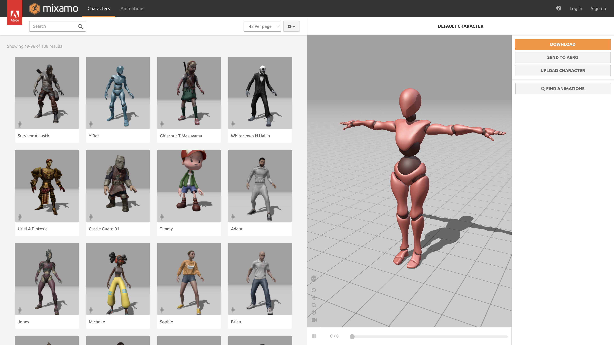

I’ll choose the **Swat Guy** character as my player model.

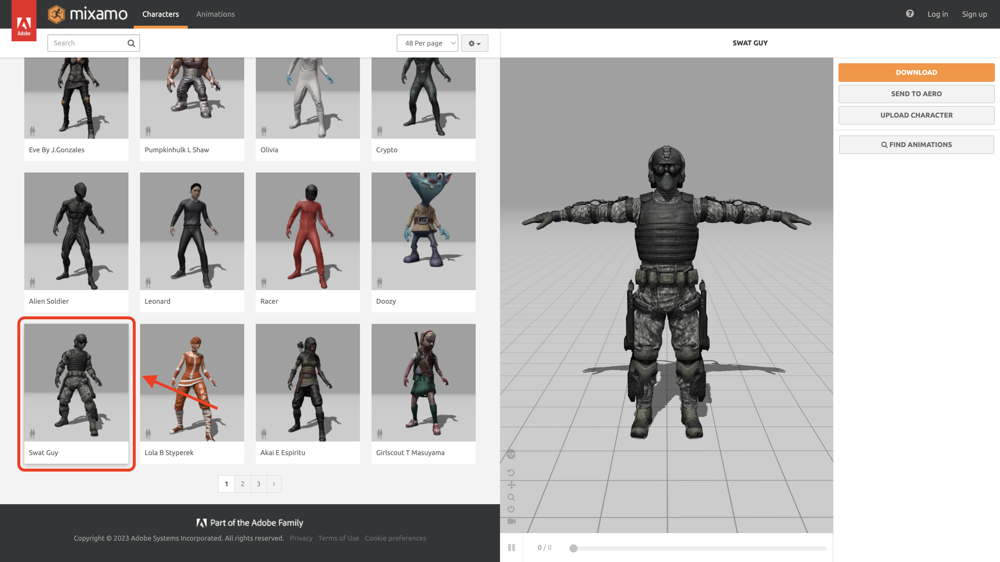

Now that I’ve chosen my character I can download it. Click the download button on the sidebar, and you should see the download dialog if you are signed in. On the download dialog under **Format** choose `FBX For Unity` and then confirm the download by clicking **Download**.

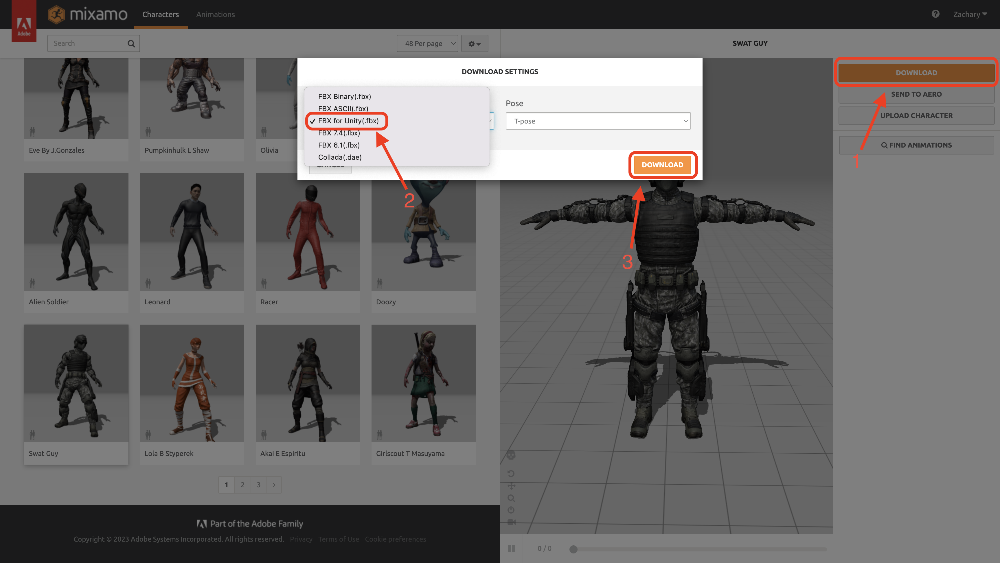

Save the model to your Unity project under the **Prefabs** folder.

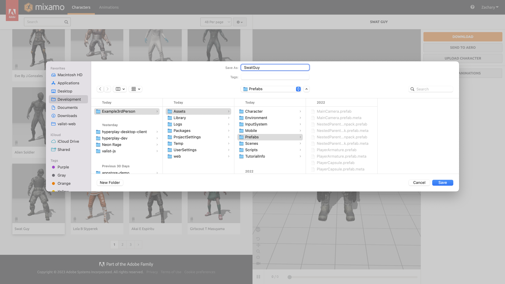

## Adding the Player Model

By navigating to the **Prefabs** folder of my project and clicking on the **SwatGuy** fbx file, we should now be able to preview the model.

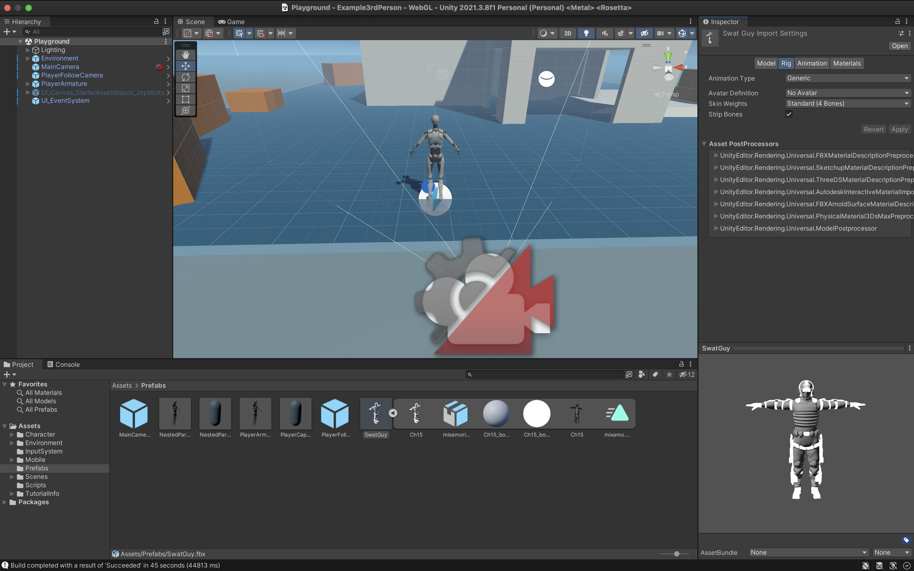

Looking good, however, you’ll notice that our new model doesn’t have any textures. To get the textures to show up we need to extract them! Click on the materials tab and then click **Extract Textures**. 

You will then be prompted to save the extracted textures from the model, we’re going to save them in a new folder we create named **Textures** from the file dialog.

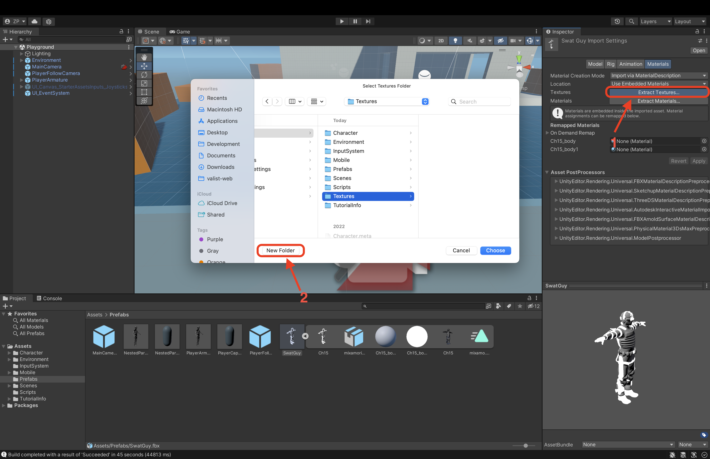

Awesome, now we should see our fully textured model! Now let’s connect our third-person controller animations to the model! In the inspector on the right sidebar click on **Rig** and then change **Animation Type** to `Humanoid` and click **Apply**.

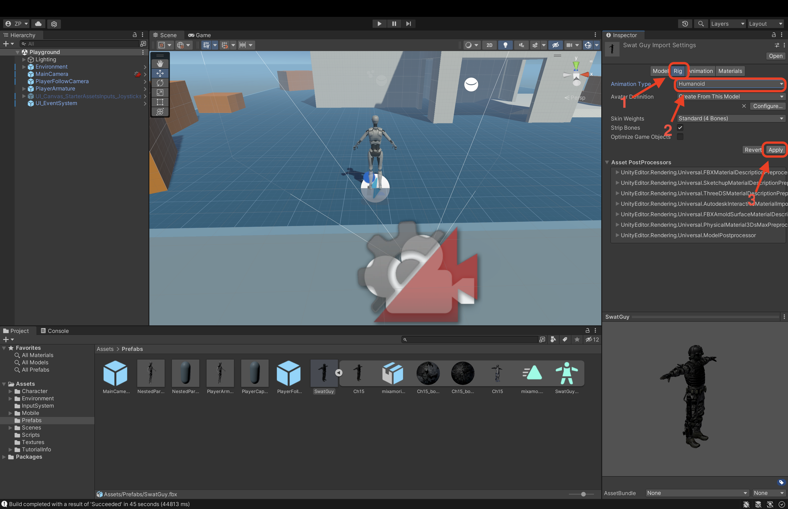

We’re now ready to start using our new model as our player character so let’s add it to our scene. Right-click on the **PlayerArmature** prefab in the Hierarchy tree on the left sidebar and go to **Prefab** and then **Unpack**. This will allow us to edit the prefab and replace the default model with our new SwatGuy model.

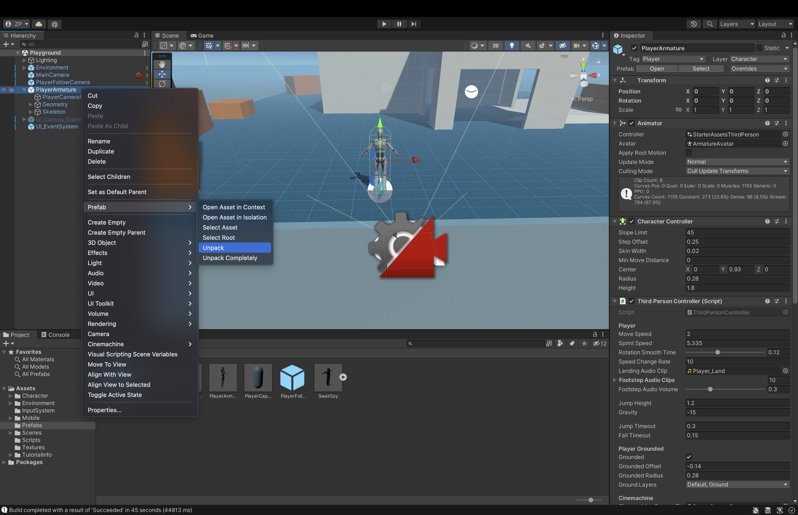

Next, inside the prefab hierarchy, we want to select the **Armature_Mesh** model under Geometry and delete it.

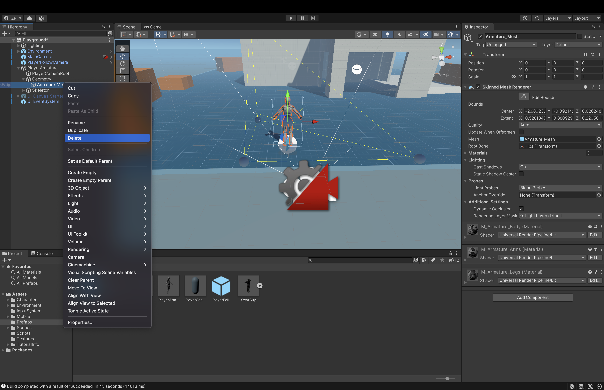

We can now drag our SwatGuy model to the same place under Geometry in the hierarchy.

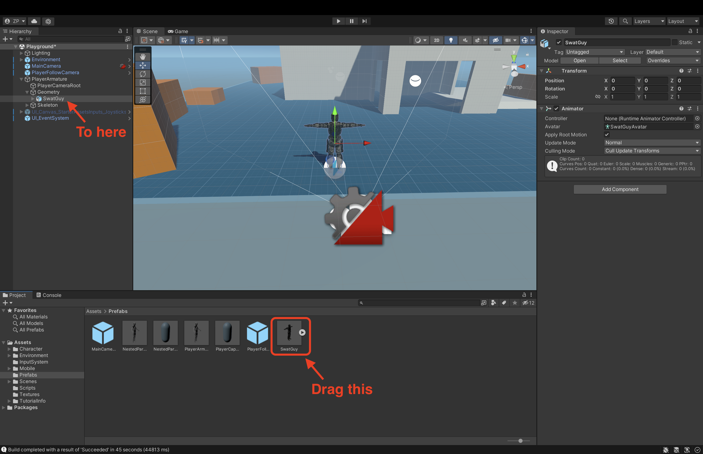

As one final thing, we need to change our **Player Armature** avatar to our new SwatGuy avatar and then we’re good to go!

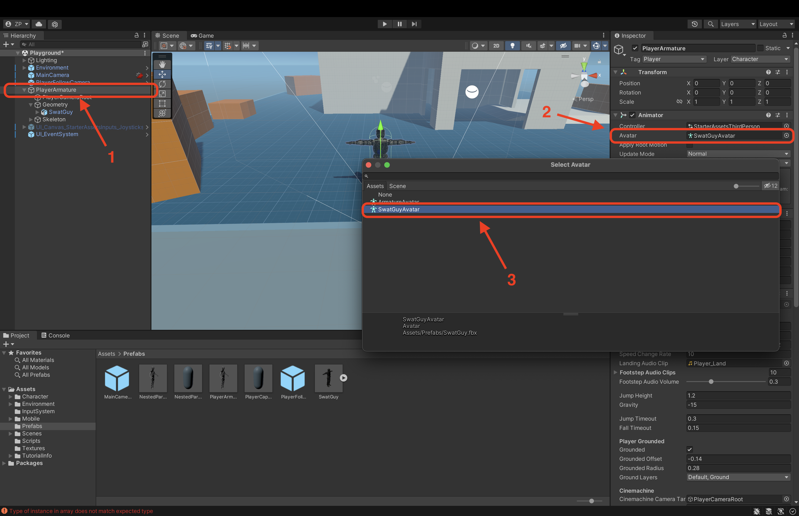
