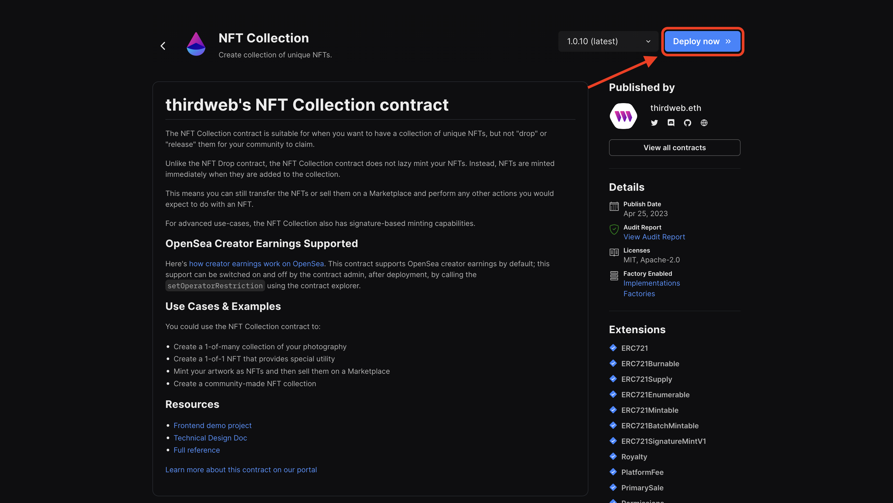
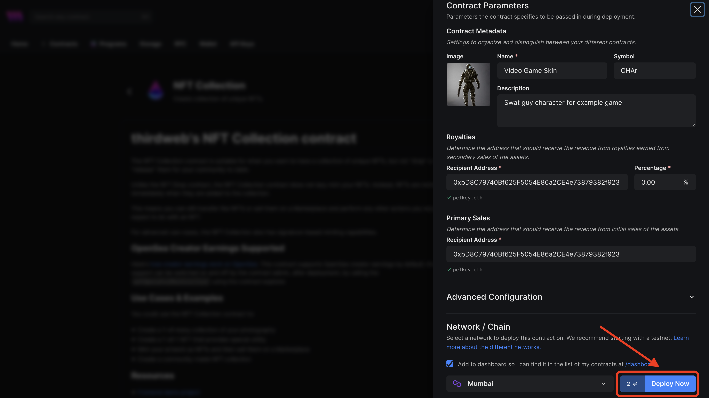
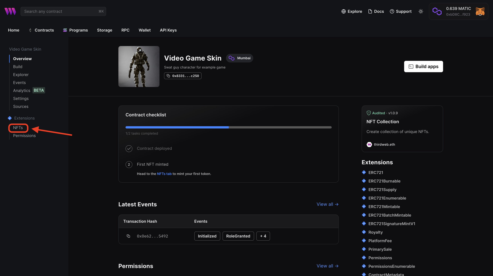
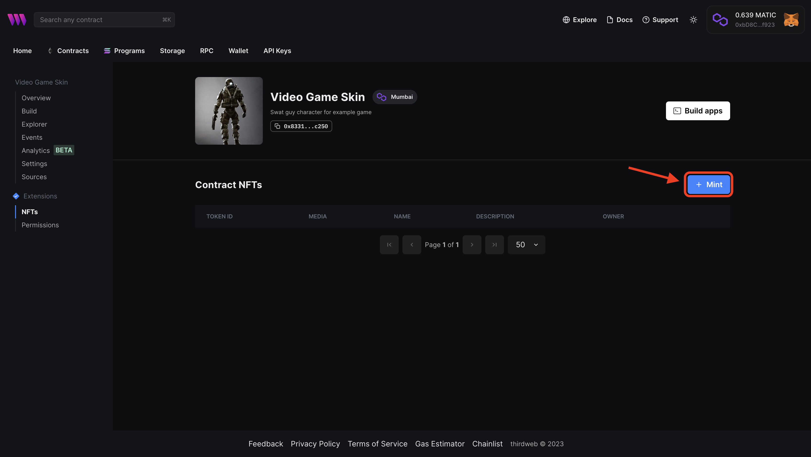
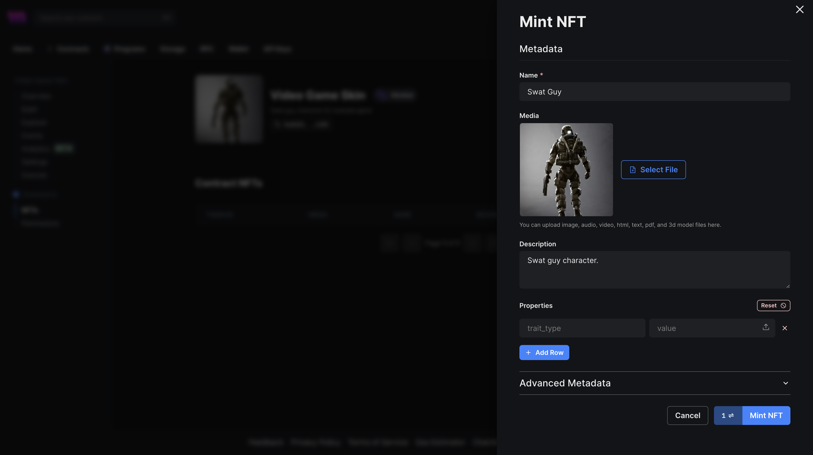
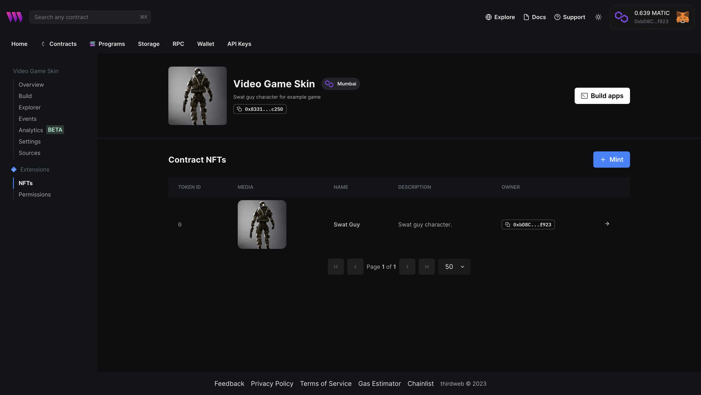
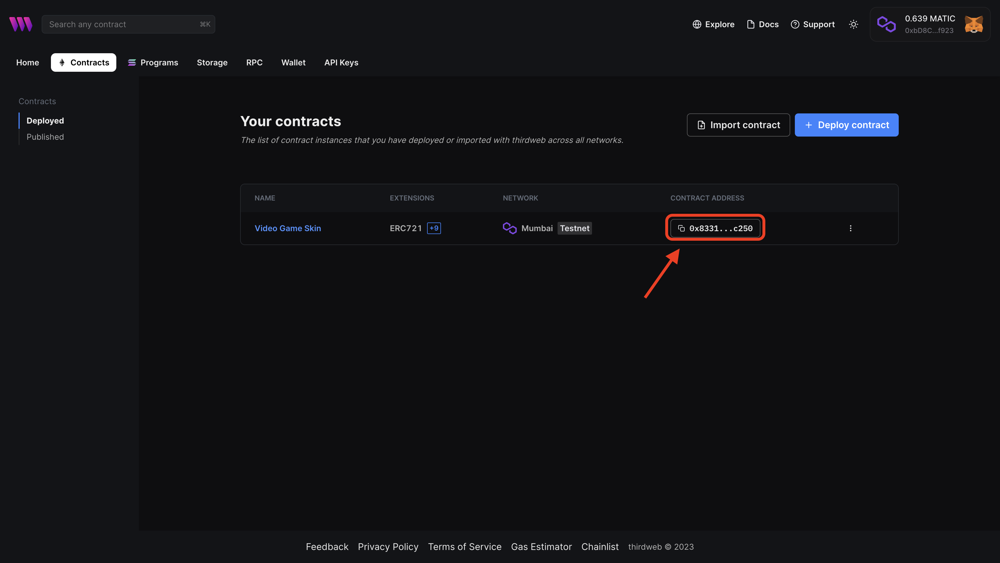

# Deploy a Smart Contract

Now that we have our player character asset imported into our game let's deploy the smart contract for this asset.

## Getting Testnet Polygon for Gas

Before we're able to deploy our smart contract we first have to get some testnet polygon to pay the gas for our contract.

A quick way to get some testnet funds is from a faucet, let's use the Quick-Node polygon faucet to request funds. [polygon-faucet](https://faucet.polygon.technology/)

## Deploying on Polygon

We can now use our mumbai polygon to deploy and mint our NFT smart contract. For this demo, we will be using ThirdWeb deploy to easily deploy our contract. YOu can navigate to the ERC720 ThirdWeb contract here: [third web deploy ERC720](https://thirdweb.com/thirdweb.eth/TokenERC721).

After connecting our wallet to the site we can hit deploy, and should be prompted to fill out some information about our contract.

Here we can fill in the details about our NFT character skin collection and then hit **Deploy Now**.

Now that our contract is deployed we're ready to mint the first NFT in our collection, we can do this by clicking NFT's in the sidebar of our contracts status page.

We can click mint to be prompted to fill in the NFT metadata.

After entering some metadata for our first NFT in the collection, we're ready to hit **Mint**!

## Getting the Contract Details

We've successfully deployed and minted our NFT character contract now for the most important pieces of information. We need to navigate back to **contracts** tab at the top and copy the **token address**.

