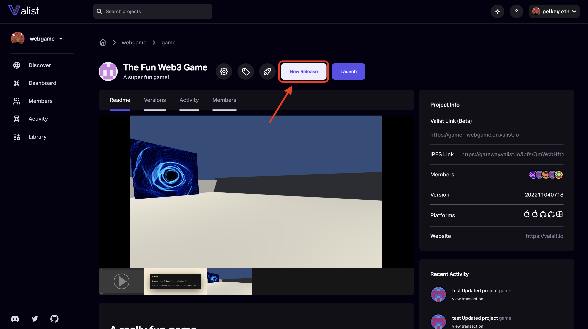
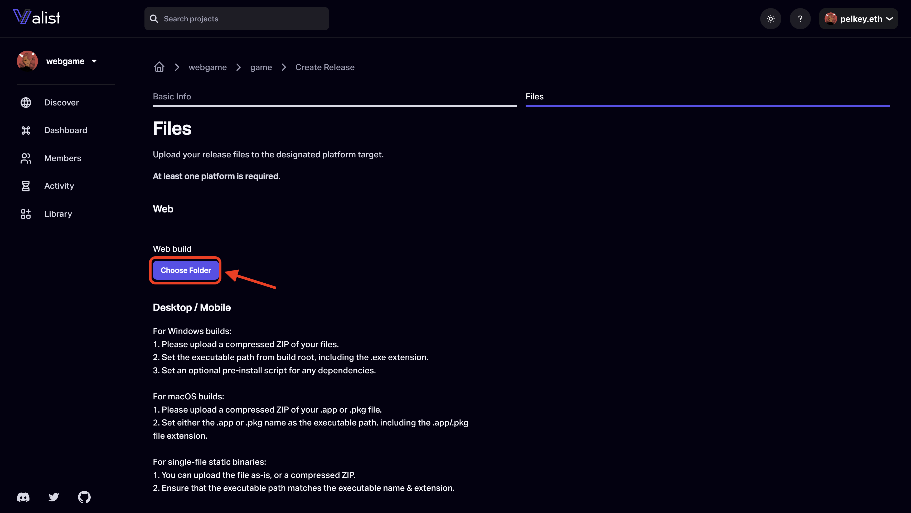

# Publishing your Game

We've created our basic demo game with ur live web3 assets token gated inside the game! But now we need a place to host our game so that others can play it!

...Valist to the rescue!

We can create a new account and project on Valist at from the [Valist dashboard](https://app.valist.io/dashboard)

Once we've created our new account/project we're ready to publish the first release of our game!

New Valist releases can be published by clicking the **New Release** button on a project's profile page.

From the release page we can fill in some basic info about the release such as the `Release Name` and any `Release Notes`.

Finally, all we have to do is select our built unity project and click **Create**!

