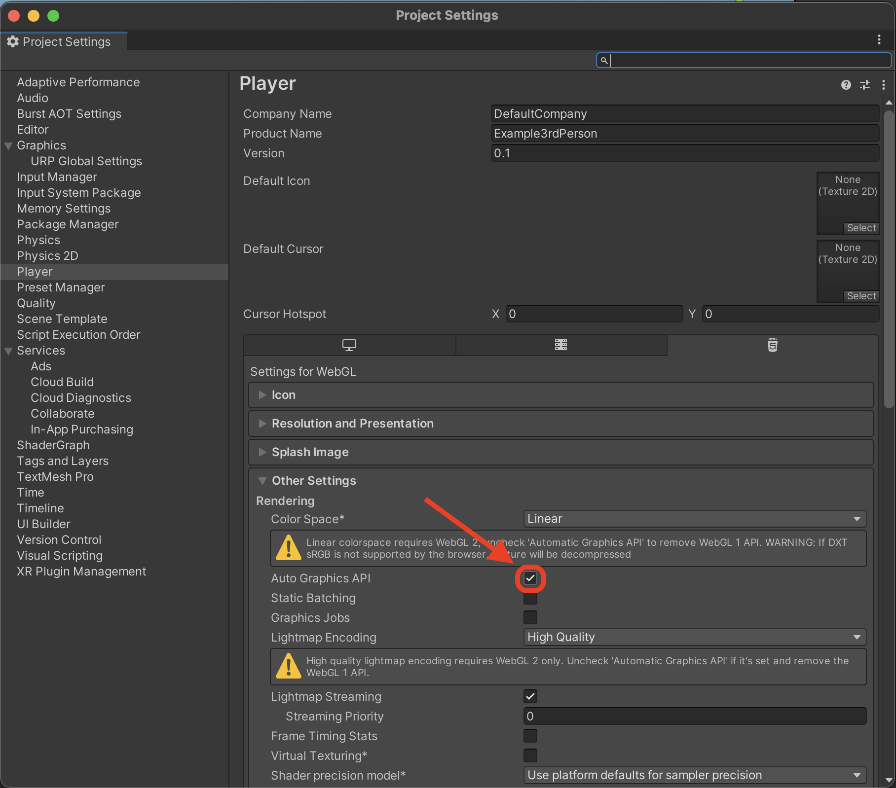
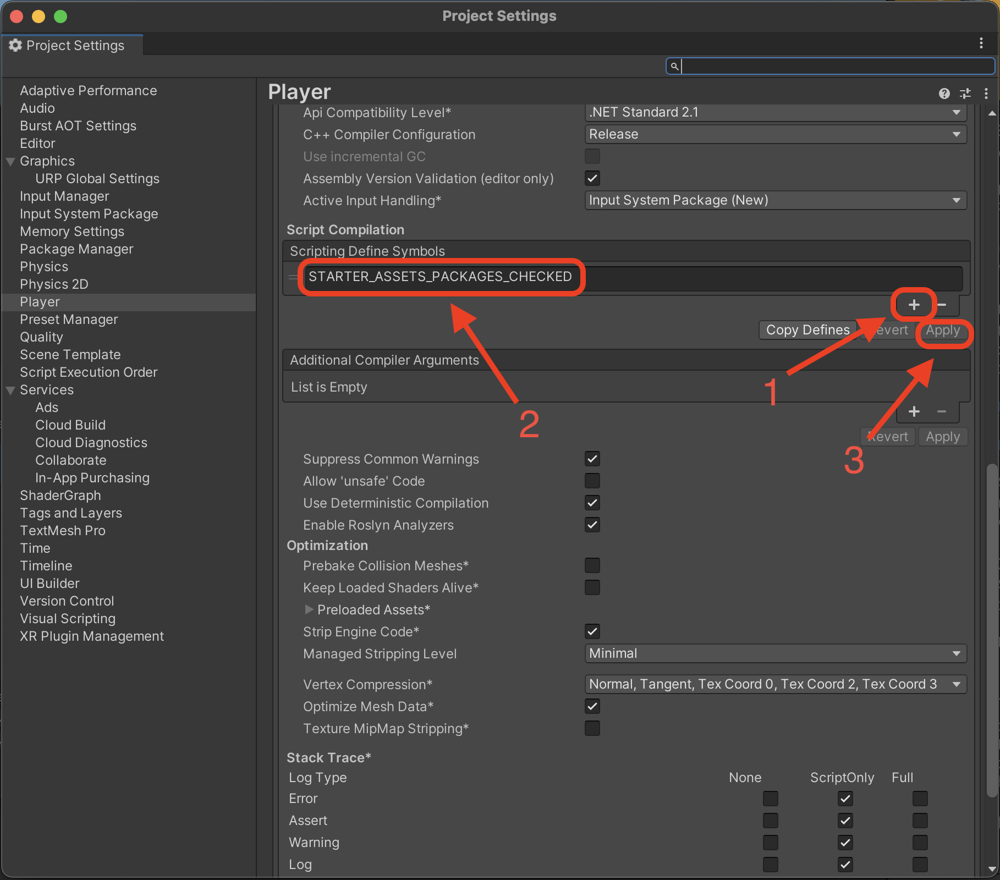

# Setting Up Your Project

Let's start bt creating a simple third-person game in Unity using the Starter Assets: Third-Person Controller!

## Using the Unity Templates

Unity provides a third-person starter template that makes it super simple to create a new Third-Person game!

## Building for Web (WebGL)

To set up the default WebGL build, we will have to fix a few errors. Click player settings to view the **Player** section of the **Build Settings**.

Next click to expand the **Other Settings** section and uncheck **Auto Graphics API**.

Scroll down to the **Script Compilation** section click the **+** button and in the box put the text `STARTER_ASSETS_PACKAGES_CHECKED`. Then click apply, and exit the dialog; now you should be ready to build for the web

Now return to the build settings dialog and hit `Build and Run`.

Congratulations you just built a basic third-person game! 🥳
