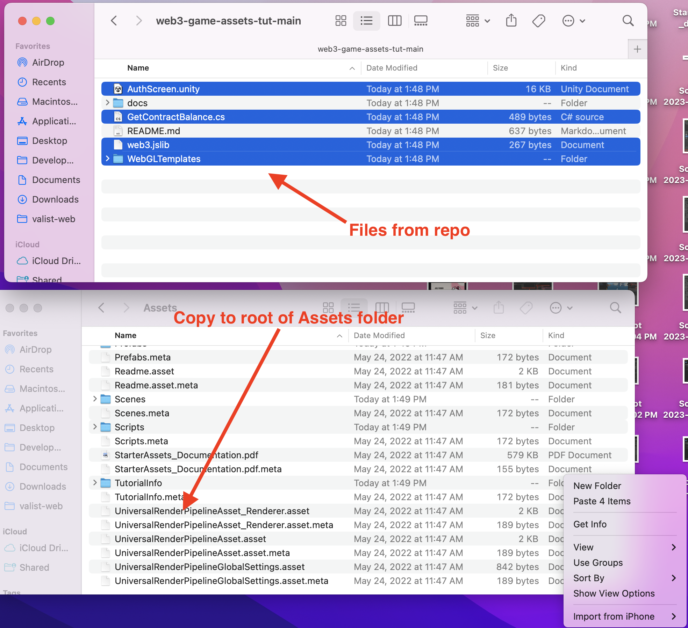
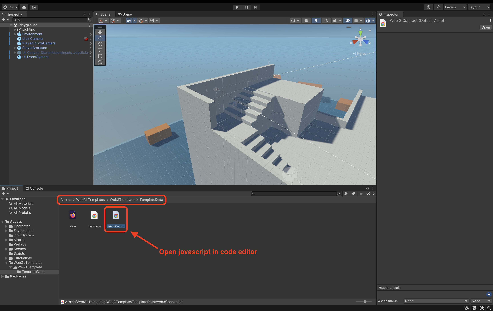
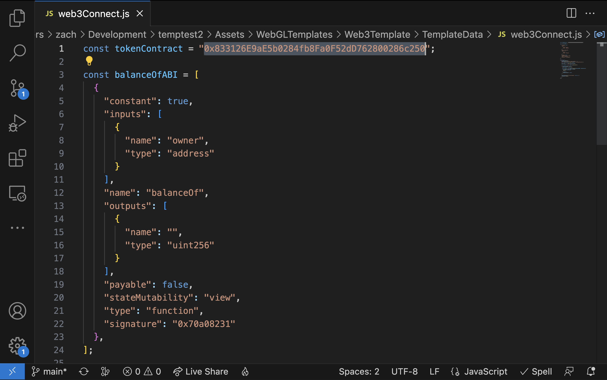
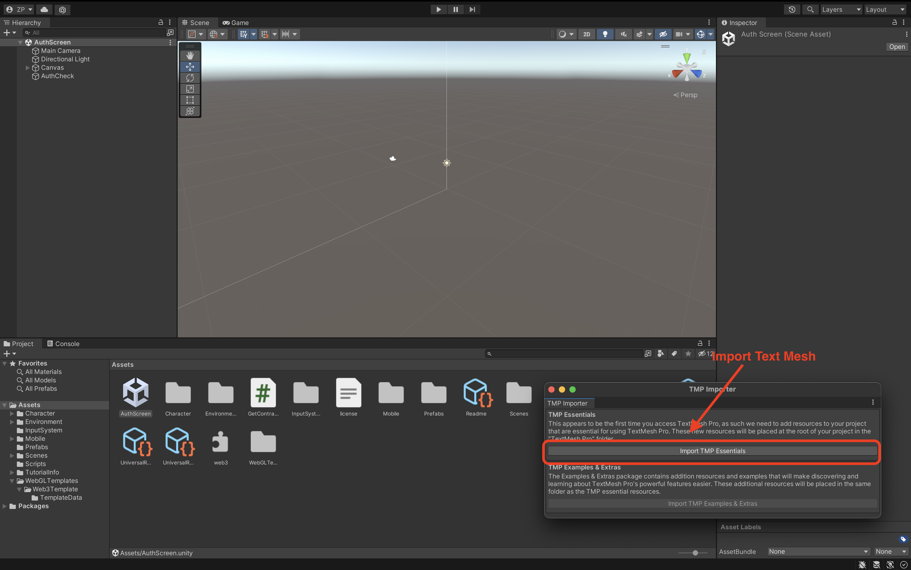
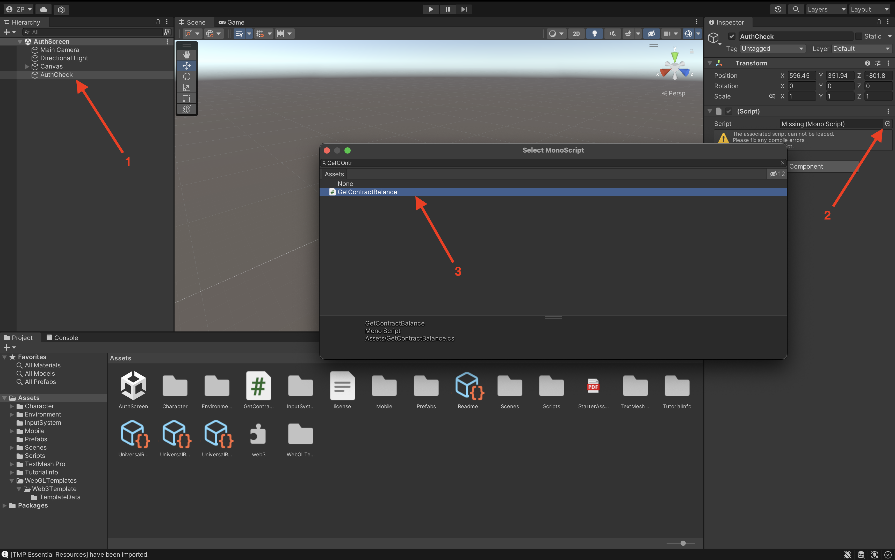
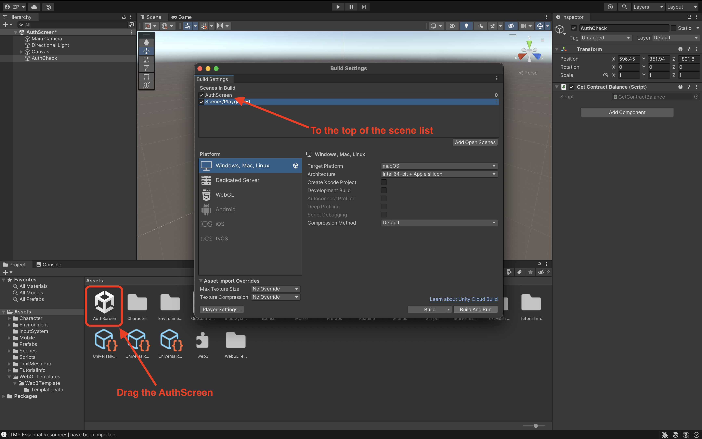
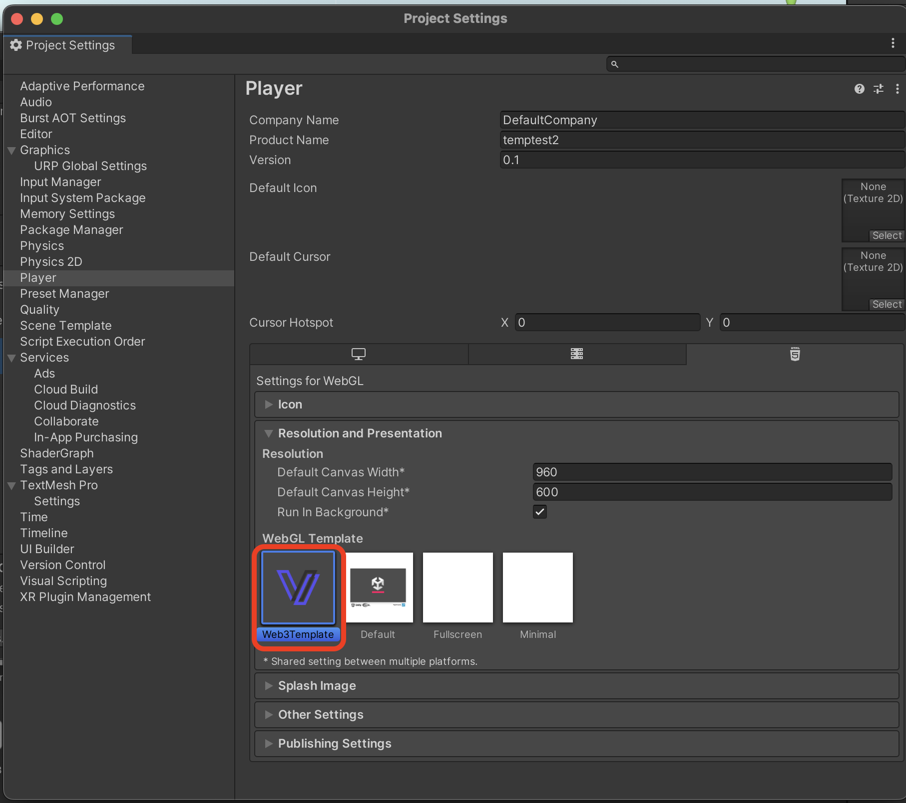

# Token Gating an Asset

Now that we have our player's character and our contract deployed we're ready to token-gate our game asset. This will make it so that only users who own this asset can play as the character!

## Connecting to an RPC Provider

The most common way to connect to a blockchain and read smart contract data is via an endpoint called an `RPC provider`. In the case of the Web/WebGL, our application is able to talk to Metmask's managed RPC providers via `window.ethereum`.

This Github repo contains a handy template for communicating with `window.ethereum` from Unity!

To get started let's download the contents of this repo into our project's assets folder.

## Adding the Balance Check

With our Web3template files added to our Unity project, we're ready to add the NFT balance check.

The first thing we have to do is update the script to point to our freshly deployed contract. If the files have been added correctly we should be able to navigate to `/Assets/WebGLTemplates/Web3Template/TemplateData/web3Connect.js` and open the javascript file in our chosen code editor.

Super simple, now all we have to do is update the `tokenContract` variable to our contract address.

Sweet now, let's take a look at our new AuthScreen by opening the `AuthScreen` file back in the root of the Assets folder.

If you're prompted to `Import TMP Essentials`. Click the button to import. Then click on the `AuthCheck` game object in the Hierarchy sidebar.

We need to add our `GetContract` script to the `AuthCheck` game object so that it checks the user's contract balance when the scene loads.
You may have to search for the script in the dialog.

## Configuring the scenes

We're almost finished, next, we have to add the `AuthScreen` to the list of game scenes in our build settings.

Now for the final step, we just have to set the web3Template as our WebGL template for our build. to do this we can click `Player Settings` and then navigate to the `Resolution and Presentation` section where all we have to do is click the `Web3Template`.

Now we're ready to build our token-gated game!
